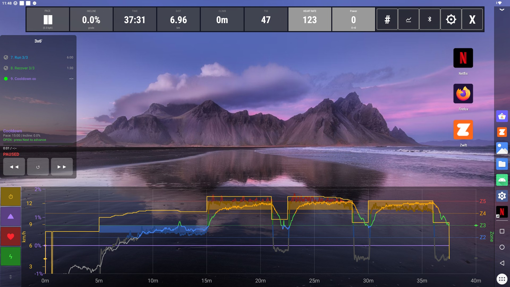
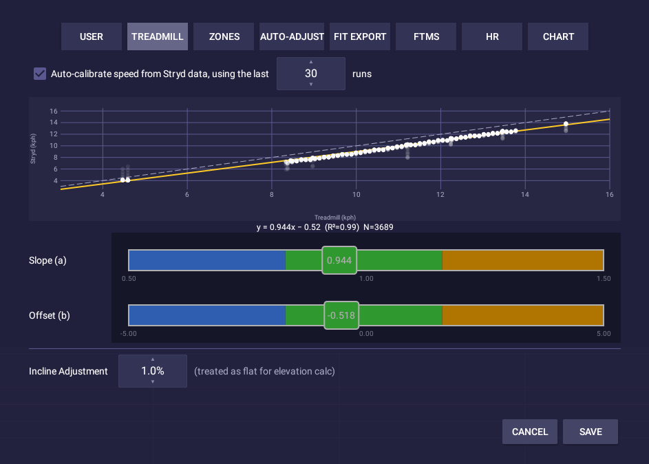
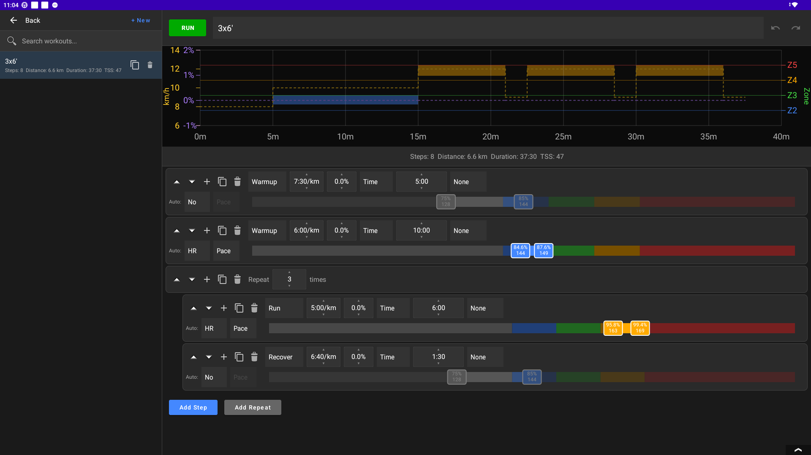
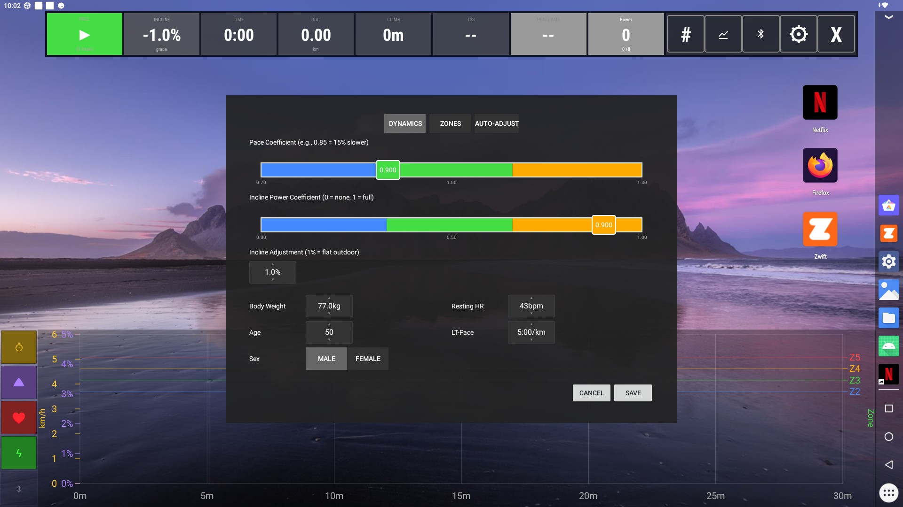
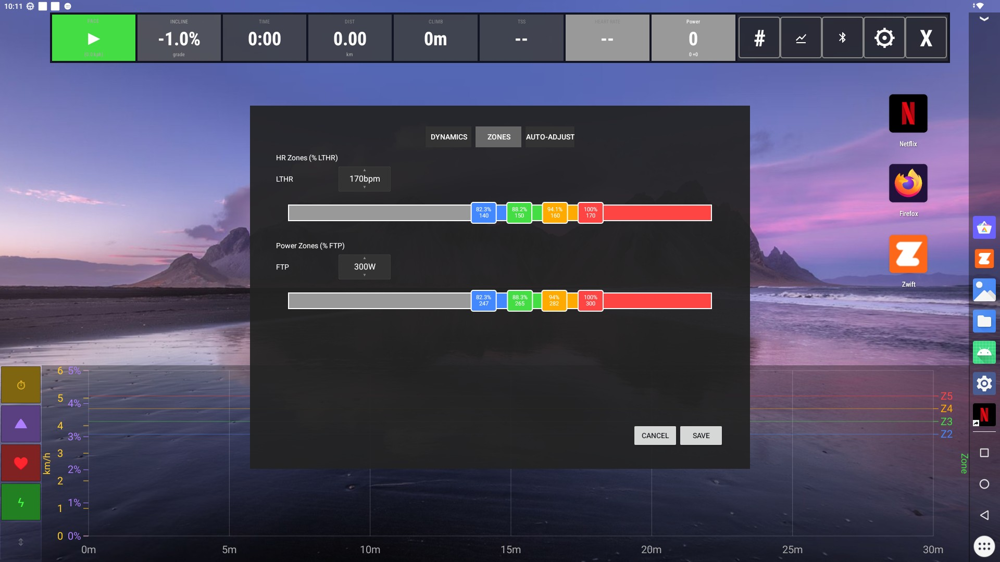
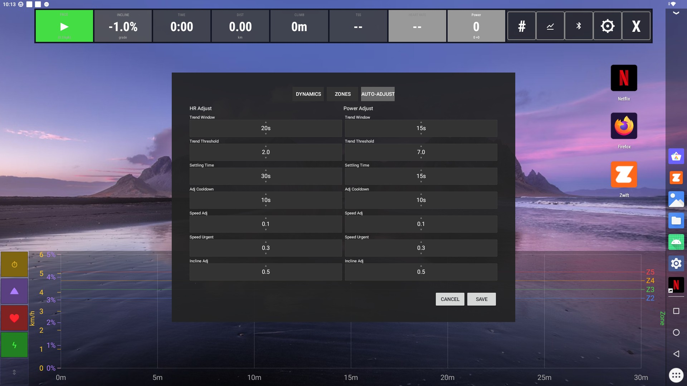
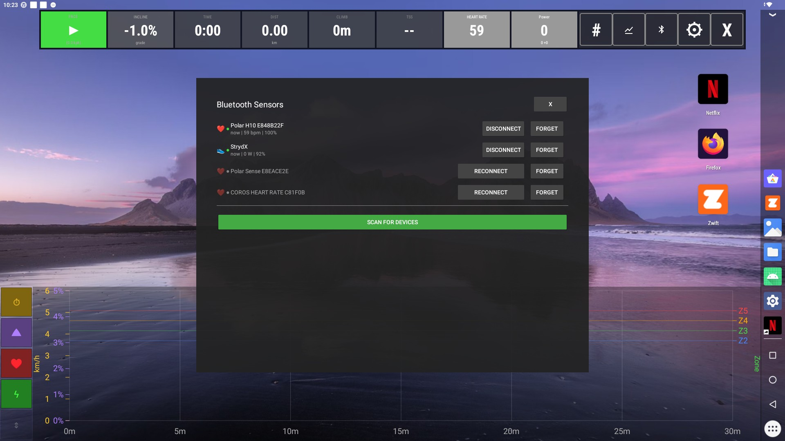

# tHUD

A heads-up display overlay for iFIT 2.0 treadmills (NordicTrack, ProForm, Freemotion, etc.).
Runs directly on the treadmill's built-in screen, and fully replaces built-in iFit app (Workout Player)
for treadmill control. I strongly recommend disabling Workout Player app to avoid interference.

Displays real-time metrics, executes structured workouts with HR and Power-based trend aware
auto-adjustment for pace or incline,and exports runs to Garmin-compatible FIT files.

Allows you to watch Netflix or any other video streaming service installed on the treadmill, 
while you are running.

Exposes your treadmill over FTMS both on Bluetooth and WiFi DirCon. Although in the end I found this
rather useless, since Zwift and most other video like running apps don't use FTMS to adjust
treadmill's speed or incline. I prefer watching videos while running.



## Foreword
Every line of code in this repo was written by Claude Code (Opus 4.5-4.6) under my close supervision.
At times this was a frustrating experience, but overall I am absolutely blown away by Claude's capabilities!

## Compatibility

- Designed for and tested on a NordicTrack X24 treadmill with iFIT 2.0 (GlassOS-based)
- Other iFIT 2.0 equipment may work but is untested
- Requires privileged access to the treadmill's Android system
- Requires wireless debugging (ADB) enabled

## Features

### Real-Time HUD Display
- Fully replaces built-in iFit app (Workout Player) for treadmill control 
- Current (adjusted) pace and raw treadmill speed
- Distance and elapsed time
- Elevation gain
- Heart rate with zone coloring (supports multiple simultaneous Bluetooth HR sensors)
- Calculated HR from RR intervals — for RR-capable HR sensors optionally computes heart rate directly from raw RR data as an independent, potentially more responsive alternative to the sensor's native BPM. Appears as a separate selectable sensor with configurable EMA smoothing, artifact filtering parameters. Parameters can be tuned retroactively during a paused run — changing settings replays all stored RR data through the filter with new parameters, instantly updating the chart
- Real-time DFA alpha1 from RR intervals — tracks aerobic (>0.75) and anaerobic (<0.5) thresholds with zone-colored HUD box. Supports per-sensor DFA computation when multiple RR-capable HR sensors are connected.

   **NOTES on DFA:**
   - DFA makes most sense on a gradual ramp test. It's almost useless on any other kind of a run.
   - Use of the Polar H10 sensor with ECG-gel is highly recommended 
   - Belching produces irregular chest wall movements that severely distort RR intervals, making DFA alpha1 readings meaningless for the duration of the analysis window. After a belch, wait for the configured window period (default 2 minutes) for the corrupted data to flush out before trusting the readings again
- Running power and cadence with zone coloring (when Stryd foot pod is connected)
- Stryd pace for comparison and treadmill speed calibration
- Speed calibration against Stryd foot pod — see [Speed Calibration](#speed-calibration-stryd) section below
- Incline adjuster. Set to a value (such as 1-1.5%), which tHUD will regard as flat running - 0%. Elevation gain is calculated taking Incline adjuster in account.

### Automatic Speed Calibration (Stryd)


Treadmills are notoriously inaccurate at reporting speed. In order to ensure that your workout pace targets
are close to reality, tHUD implements linear regression model: `adjusted speed = a × treadmill speed + b`, calculated using your last N runs with a footpod. The slope `a` captures the proportional error, and the intercept `b` accounts for any constant offset. When `b = 0` (the default), this simplifies to the traditional single-coefficient approach.

Two modes are available:
- **Auto-calibrate** — check the box and tHUD automatically updates linear regression coefficients after each run with Stryd footpod connected. You choose how many recent runs to include (5–90). The more runs at varied speeds, the better the fit.
- **Manual** — when you have no Stryd footpod or you haven't run any runs with them yet, you may adjust Slope (a) and Offset (b) manually.

All internal logic — workout engine pace targets, chart, auto-adjustment, recording, FIT export — uses calibrated speed. Raw treadmill speed is preserved in FIT files developer fields for traceability.

### User Profiles
- Multiple user profiles with full data isolation — each user gets their own settings, workouts, Garmin Connect credentials, FIT exports, and screenshots

### Live Run Chart
- Speed, Incline, HR, and Power lines can be toggled on/off
- HR and Power lines are color coded with zone color
- Colored horizontal zone border lines for reference 
- Visual workout steps structure with speed & incline target lines and HR/Power target ranges
- Three Y-axis zoom modes cycled via toggle button: Timeframe (configurable 1–60 min window), Main Phase (fits main workout only), Full (all data)

### Structured Workouts

- Create custom interval workouts with the built-in editor
- Repeat blocks for intervals, which can contain any number of steps
- Time-based or distance-based step durations, with an option to keep going until Next button is pressed
- Pace and incline targets per step, with optional pace progression (gradual speed change from start to end pace within a step)
- Optional HR and Power target zones per step with pace/incline auto-adjustment
- Early step ending on HR reaching certain levels
- Full undo/redo support in editor
- Default Warmup and Cooldown templates — edit once, attach to any workout

### Auto-Adjustment (HR or Power)
- Each workout step can pick either HR or Power and define a target zone for it
- It also has to choose either pace or incline to be auto-adjusted in order to keep HR/Power in the target zone
- Trend-aware algorithm prevents overcorrection
- Auto-adjustment coefficient isolation between warmup/main/cooldown phases (HR auto-adjustments during warmup don't affect the main workout steps)
- Adjustment scope per workout. Either "All steps", which scales the entire phase uniformly (e.g., "I'm tired today"); or "One step", which keeps each step's coefficients independent, with repeat intervals sharing per step coefficients across repetitions
- Manual speed and incline adjustment buttons also adjust effort level according to the chosen scope

### Power-Based Training (Stryd)
- Connect Stryd foot pod via Bluetooth
- Display running power, cadence and pace in real-time
- Power zone coloring
- Power reading is corrected for incline

### BLE Remote Control
- Control treadmill speed, incline, belt, and workout navigation from BLE remote controls (camera shutters, media remotes)
- Remotes pair with Android as HID keyboards — no special hardware required
- Configurable key bindings per remote with learn-mode key detection
- Adjustable increment values for speed (0.1–2.0 kph) and incline (0.5–5.0%)
- **Two modes** with a toggle button on the remote:
  - **Mode 1 (Take-over):** Remote keys control tHUD (speed, incline, belt, workout steps)
  - **Mode 2 (Pass-through):** Remote keys trigger Android actions (media play/pause, next/prev track, volume, mute, Back/Home/Recent Apps)
- Fallback: keys bound in only one mode work in both; keys bound in both modes follow mode priority
- Same physical key can be assigned different actions per mode
- HUD button with mode indicator and blink feedback on key press
- Requires enabling tHUD Accessibility Service in Android Settings

### Auto-Screenshot
- Capture the full screenshot of the treadmill's screen
- When taking a screen while watching Netflix or other DRM-protected content, the resulting black background is nicely replaced with the Home wallpaper
- Toggle screenshot mode with the camera button in HUD
- Automatic screenshots on workout step transitions and pause
- Screenshots saved to `Downloads/tHUD/<ProfileName>/screenshots/`
- Filename matches FIT file naming for easy correlation
- The last screenshot of the run is auto-uploaded to Garmin Connect with the FIT file

### FIT File Export
- Automatic export when run ends
- Full Garmin Connect, Strava and Stryd PowerCenter compatibility
- Lap data for structured workouts
- Full incline/grade data
- Power and cadence from Stryd
- Multi-HR sensor data preserved as developer fields (per-sensor BPM traces + DFA alpha1 values)
- HRV data: RR intervals exported as FIT HrvMesg (message 78) for analysis in Runalyze, Kubios, Intervals.icu
- Multi-FIT file export: when multiple RR-capable HR sensors are connected, one FIT file per sensor is exported (identical workout data, sensor-specific HRV stream). Only the file that includes HRV data from the sensor selected as DFA-primary sensor is uploaded to Garmin Connect
- TSS (Training Stress Score) calculation with 3-tier fallback: Power → HR → Pace
- Files saved to `Downloads/tHUD/<ProfileName>/`
- Settings for device parameters in FIT Export tab
   - **IMPORTANT for Garmin Acute/Chronic Training Load calculation:**
      1. **Device serial in FIT settings MUST be different from your main Garmin watch** (otherwise the watch won't sync the file - it thinks it already has it)
      2. **After uploading the FIT file to Garmin Connect, sync your watch TWICE** - first sync downloads the file to watch for processing, second sync uploads calculated metrics back
- Power data is written as Stryd developer fields so Stryd PowerCenter recognizes it automatically
- Raw and calibrated treadmill speeds recorded as developer fields for traceability
- Option to use Stryd speed as the primary speed source in FIT files (enabled by default) — when active, Stryd speed replaces calibrated treadmill speed and distance/elevation are recalculated from it

### Garmin Connect Auto-Upload
- Automatic upload to Garmin Connect after FIT export (opt-in)
- Sign in via embedded Garmin SSO WebView (supports MFA)
- OAuth tokens stored securely in encrypted storage on-device (per-profile)
- Screenshot auto-attachment as activity photo
- Automatic token refresh (~1 hour OAuth2 lifecycle, ~1 year OAuth1)
- Re-authentication prompt on token expiry

### Reliability
- Run crash recovery with periodic auto-save
- Reconnection handling preserves run data
- Double-stop confirmation prevents accidental run endings

## Installation Guide

### Step 1: Gain Privileged Access to Your Treadmill

Your treadmill runs a locked-down Android system with iFIT/GlassOS. Before you can install tHUD, you need to:

1. Gain privileged access to your treadmill
2. Enable Developer Options
3. Enable Wireless Debugging (ADB over WiFi)

This process varies by treadmill model. Search for guides specific to your model, or ask an AI assistant for step-by-step instructions.

### Step 2: Set Up Android Development Tools

You'll need [Android SDK](https://developer.android.com/studio) to build and install tHUD. The easiest way is to install Android Studio, which includes everything you need.

Once installed, clone and build tHUD:

```bash
git clone https://github.com/a-vikulin/thud.git
cd thud
./gradlew assembleDebug
```

The APK will be created at `app/build/outputs/apk/debug/app-debug.apk`

### Step 3: Extract and Install Certificates

tHUD communicates with your treadmill's GlassOS service using mTLS authentication. You must extract certificates from the iFit app before tHUD can connect.

Follow the instructions at **[tHUD-certs](https://codeberg.org/avikulin/tHUD-certs)** to extract certificates from your treadmill's iFit APK, then push them to the treadmill:

```bash
# Connect to treadmill via ADB
adb connect <treadmill-ip>:<port>

# Create certs folder and push certificates
adb shell mkdir -p /sdcard/Android/data/io.github.avikulin.thud/files/certs/
adb push ca.crt /sdcard/Android/data/io.github.avikulin.thud/files/certs/
adb push client.crt /sdcard/Android/data/io.github.avikulin.thud/files/certs/
adb push client.key /sdcard/Android/data/io.github.avikulin.thud/files/certs/
```

### Step 4: Install tHUD

Install the APK (reconnect with `adb connect` first if needed):

```bash
adb install app/build/outputs/apk/debug/app-debug.apk
```

## Setup

### Initial Configuration

1. Launch tHUD from the app drawer
2. Grant overlay permission when prompted
3. Grant notification permission (required for foreground service)
4. When first using the screenshot feature, grant screen recording permission when prompted (used for capturing screenshots only, not video)
5. On first launch, tHUD creates a default "User" profile. Open Settings (gear icon) → User tab to:
   - Set your name (used for file organization under `Downloads/tHUD/<Name>/`)
   - Optionally set a PIN to protect your profile
   - Create additional profiles for family members sharing the treadmill
6. Open Settings → Treadmill tab to configure:
   - Speed calibration: start with manual Slope (a) = 1.0 if you don't have a Stryd yet, or enable Auto-calibrate if you do — it will improve after each run
   - Incline Power Coefficient: 0.85 seems right to me
   - Incline Adjustment: set to 1%, meaning when treadmill is at 1% the HUD will call that 0% and will calculate elevation gain based on 0% incline for saving in FIT files
   - Set other parameters if you want to see realistic TSS load calculation

### HR/Power Zones


Set you Lactate threshold and FTP, plus HR/Power zones as percentages of LTHR and FTP

### Auto-adjust parameters


Verify that auto-adjustment parameters are sensible

### Connecting Bluetooth Sensors

1. Tap the Bluetooth icon in the HUD
2. Scan and select your device
3. Device will auto-connect on future sessions
4. Multiple HR sensors can be connected simultaneously — tap the HR box to switch between sensors or use the average of all

### Creating Workouts
1. Tap the "#" workout icon to open the editor
2. Add steps using the + button
3. Configure each step:
   - Type (Warmup, Run, Recover, etc.)
   - Duration (time or distance)
   - Target pace (with optional progression checkbox ">" to set an end pace — speed changes gradually over the step duration)
   - Target incline
   - HR or Power targets (optional)
4. Use Undo/Redo buttons if needed
5. Optionally enable "Use Default Warmup" / "Use Default Cooldown" checkboxes to attach reusable templates
6. Edit the Default Warmup or Default Cooldown workouts (pinned at top of the list) to customize them
7. Workout is saved after every edit
8. Tap Run to run the workout

## Usage

### Starting a Free Run
1. For a free run either use physical Start button or touch Pace HUD box and select desired pace/speed
2. tHUD starts the run and sets incline to effective 0%

### During a Run
- Use physical Speed +/- buttons or a configured BLE remote to adjust speed, or use Pace box in the HUD to open popup menu with a list of paces
- Use physical Incline +/- buttons or a configured BLE remote to adjust incline, or use Incline box in the HUD to open popup menu with a list of inclines
- Tap Chart button in the HUD to show/hide Chart
- Tap X button in the HUD to hide all HUD panels
- To open HUD again use tHUD icon. Installing Taskbar is highly recommended for that
- Workout panel shows current step, progress and gives 3-2-1-GO! beep sequence between steps 
- Tap the camera button to enable/disable auto-screenshots

### Ending a Run
1. Use physical Stop button to pause your run
2. When paused, press the physical Stop button again to end the run
3. FIT file exports automatically
4. Find your file in `Downloads/tHUD/<ProfileName>/`

### Setting Up a BLE Remote

#### Choosing a Remote

> **Warning:** Most cheap TikTok scrollers and camera shutter remotes found on Amazon/AliExpress do **not** work as BLE keyboards. They typically send swipe actions that tHUD cannot intercept as key events. tHUD requires a remote that pairs with Android as an HID keyboard device.

**Recommended: [8BitDo Micro](https://www.8bitdo.com/micro/)** — a compact Bluetooth gamepad that works perfectly with tHUD. It pairs as an HID keyboard, has enough buttons for all essential actions across both modes, and is small enough to hold comfortably while running.


#### Connecting Your Remote

1. **Pair the remote** with your treadmill via Android Settings → Bluetooth → Pair new device
2. **Restore the virtual keyboard** (important!): When a Bluetooth HID device is paired, Android hides the on-screen keyboard system-wide. To fix this:
   - Go to **Settings → System → Languages & input → Physical keyboard**
   - Enable **"Show on-screen keyboard"**
   - Without this, you won't be able to type in Netflix search, browser, or any other app
3. **Enable the Accessibility Service**: Android Settings → Accessibility → tHUD
4. **Configure bindings in tHUD**: Tap the remote (gamepad) icon in the HUD to open the config activity
5. Tap "+ Add" and select your remote from the list (or use Auto-detect)
6. For each action, tap the key button and press the corresponding button on your remote
7. Adjust increment values with the spinners for speed/incline actions

## Privacy

- No telemetry or analytics
- FIT files are stored locally until you transfer them
- Garmin Connect auto-upload is opt-in and disabled by default. When enabled, FIT files and screenshots are sent to Garmin Connect using your Garmin account credentials, which are stored encrypted on the treadmill

## License

GNU General Public License v3.0 - see [LICENSE](LICENSE) file

## Contributing

Contributions are welcome! Please:
1. Fork the repository
2. Create a feature branch
3. Submit a pull request

For major changes, please open an issue first to discuss.

## Disclaimer

This software is provided as-is. Modifying your treadmill's software may void your warranty. Use at your own risk.
